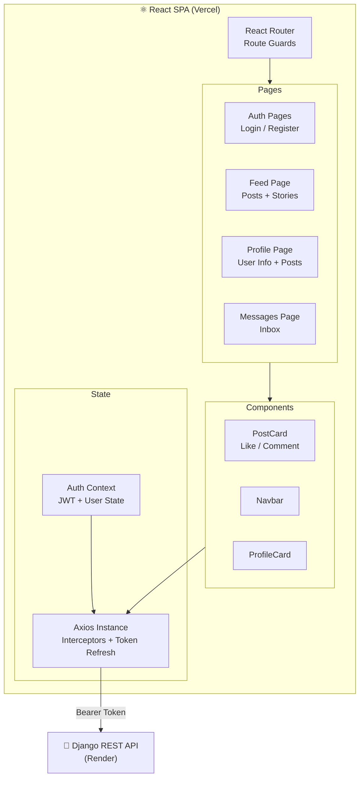
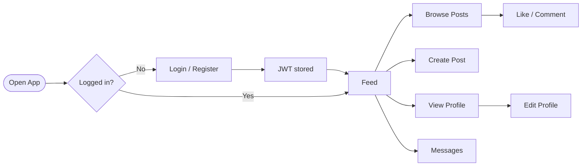

<div align="center">

# 🔗 LinkdPlus — Frontend

**A career social networking platform — React frontend**

[](https://react.dev)
[](https://vitejs.dev)
[](https://tailwindcss.com)
[](https://vercel.com)

> **Status: archived.** The hosted Django backend is offline, so the deployed frontend loads but cannot fetch any data. This repository is the source code and architecture.

📦 **Backend Repo →** [LinkdPLus_backend](https://github.com/Tushal27/LinkdPLus_backend)

</div>

---

## 📖 About

LinkdPlus is a full-stack career social platform. This is the React frontend — a responsive SPA that communicates with the Django REST backend via JWT-authenticated API calls. Built and deployed entirely solo.

---

## ✨ Features

- 🔐 **JWT Authentication** — Register, login, auto token refresh
- 📰 **Social Feed** — Browse and create posts in real time
- ❤️ **Likes & Comments** — Engage with posts
- 👤 **Profile Management** — Update bio and profile photo via Cloudinary
- 📬 **Messaging** — Contact other users
- 📱 **Fully Responsive** — Mobile-first design with Tailwind CSS

---

## 🏗️ Application Architecture



---

## 🔄 User Journey



---

## ⚙️ Tech Stack

| Layer | Technology |
|-------|-----------|
| Framework | React 18 + Vite |
| Styling | Tailwind CSS |
| Auth | JWT (access + refresh tokens) |
| HTTP | Axios with interceptors |
| Media | Cloudinary |
| Routing | React Router v6 |
| Deployment | Vercel |

---

## 🛠️ Local Setup

```bash
# 1. Clone the repo
git clone https://github.com/Tushal27/LinkdPlus-Frontend.git
cd LinkdPlus-Frontend

# 2. Install dependencies
npm install

# 3. Create .env file
cp .env.example .env
# Set VITE_API_BASE_URL to your backend URL

# 4. Start dev server
npm run dev
```

### Environment Variables
```env
VITE_API_BASE_URL=https://your-backend.onrender.com
```

> For local development, set `VITE_API_BASE_URL=http://localhost:8000`

---

## 📁 Project Structure

```
LinkdPlus-Frontend/
├── src/
│   ├── components/     # Reusable UI components
│   ├── pages/          # Route-level pages
│   ├── context/        # Auth context + state
│   ├── api/            # Axios instance + API calls
│   └── main.jsx        # Entry point
├── public/
├── index.html
├── vite.config.js
├── vercel.json         # Vercel routing config
└── package.json
```

---

<div align="center">

Built with ❤️ by [Tushal J](https://github.com/Tushal27) · [LinkedIn](https://linkedin.com/in/tushal-j)

</div>
